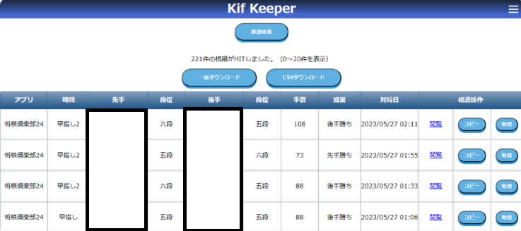

# オンライン将棋棋譜の収集・管理アプリケーション
KifKeeperは、将棋倶楽部24や将棋ウォーズなどに代表されるオンライン将棋の棋譜を収集します。 
収集した棋譜を管理し、お好みの条件（勝敗結果や対戦相手など）で検索することができます。  

# 本アプリケーションの作成背景
知人がプログラミング学習をしたいとの要望あり、作成したアプリケーションになります。 
JavaやSpringBootを利用したWEBアプリケーションを学ぶにあたり、SpringBootを用いた 
基本的な3層モデルや、データベースに対するCRUD操作を機能として盛り込んでいます。 
また知人の興味があったWEBスクレイピング機能を実装しています。  

# 機能一覧

## 基本機能
- 棋譜のオンライン収集

アプリとユーザーを指定して、棋譜のスクレイピングを実施します。

- 棋譜の検索

スクレイピングした棋譜は、さまざまな条件で検索可能です。

また検索した棋譜のCSVダウンロードや、オンラインでの閲覧も可能です。

## 管理機能
- 棋譜のオンライン収集対象の登録

アプリごとに、スクレイピング対象のユーザーIDを登録します。

- 将棋倶楽部24 ユーザー設定

将棋倶楽部24というサービスではログイン後でなければ棋譜検索ができないため、ログイン情報の登録が必要となります。

## その他
- メインメニュー

- サイドメニュー

 

# 使用技術

## フロントエンド
- HTML
- CSS
- JavaScript
- JQuery
- Thymeleaf

## バックエンド
- Java 17
- SpringBoot 3.0.5
- MySQL 8.0.17
- selenium-java 4.5.3
- webdriver-manager 5.3.0

## その他（開発ツールなど）
- Docker（開発環境におけるDBのコンテナとして利用）
- POM
- Git（EGit）
- Eclipse Version: 2023-03 (4.27.0)
- A5:SQL Mk-2

 

# 参考：スクレイピング対象サイト
[将棋倶楽部２４ 棋譜検索](https://www.shogidojo.net/shogi24kifu/)  
[将棋ウォーズ 棋譜検索](https://www.shogi-extend.com/swars/search/)  
[将棋クエスト 棋譜検索β](https://c-loft.com/shogi/quest/)  
本アプリケーションは、上記対象サイトが2023年5月時点でのウェブページに対応しています。 
それ以降のウェブページ更新には未対応のため、現在は動作しない可能性があります。 
